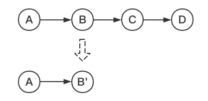
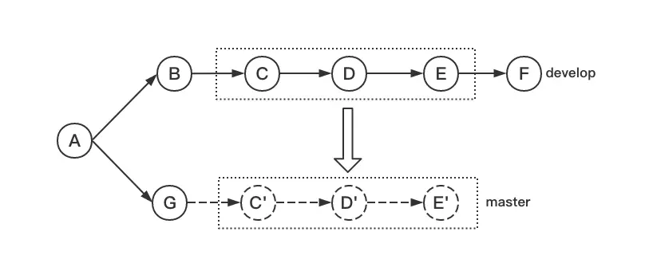

# git
## git基本原理
Git 和其它版本控制系统（包括 Subversion 和近似工具）的主要差别在于 Git 对待数据的方式。 从概念上来说，其它大部分系统以文件变更列表的方式存储信息，这类系统（CVS、Subversion、Perforce、Bazaar 等等） 将它们存储的信息看作是一组基本文件和每个文件随时间逐步累积的差异 （它们通常称作基于差异（delta-based）的版本控制）。
Git 不按照以上方式对待或保存数据。反之，Git 更像是把数据看作是对小型文件系统的一系列快照。 在 Git 中，每当你提交更新或保存项目状态时，它基本上就会对当时的全部文件创建一个快照并保存这个快照的索引。 为了效率，如果文件没有修改，Git 不再重新存储该文件，而是只保留一个链接指向之前存储的文件。 Git 对待数据更像是一个 快照流。

## git文件状态
### 三种状态
- 已修改（modified） 已修改表示修改了文件，但还没保存到数据库中
- 已暂存（staged） 已暂存表示对一个已修改文件的当前版本做了标记，使之包含在下次提交的快照中
- 已提交（committed） 已提交表示数据已经安全地保存在本地数据库中

基本的 Git 工作流程如下：
1. 在工作区中修改文件。
2. 将你想要下次提交的更改选择性地暂存，这样只会将更改的部分添加到暂存区。
3. 提交更新，找到暂存区的文件，将快照永久性存储到 Git 目录。
如果 Git 目录中保存着特定版本的文件，就属于 已提交 状态。 如果文件已修改并放入暂存区，就属于 已暂存 状态。 如果自上次检出后，作了修改但还没有放到暂存区域，就是 已修改 状态。


## 记录每次更新到仓库

### 已跟踪，未修改
```
$ git status
On branch master
Your branch is up-to-date with 'origin/master'.
nothing to commit, working directory clean
```
### 新增未跟踪文件（untracked）
```
$ echo 'My Project' > README
$ git status
On branch master
Your branch is up-to-date with 'origin/master'.
Untracked files:
  (use "git add <file>..." to include in what will be committed)

    README

nothing added to commit but untracked files present (use "git add" to track)
```
### 未跟踪状态文件跟踪并暂存（staged）
`git add <files>`
```
$ git status
On branch master
Your branch is up-to-date with 'origin/master'.
Changes to be committed:
  (use "git restore --staged <file>..." to unstage)

    new file:   README
```
### 暂存已修改文件（modified）
```
$ git status
On branch master
Your branch is up-to-date with 'origin/master'.
Changes to be committed:
  (use "git reset HEAD <file>..." to unstage)

    new file:   README

Changes not staged for commit:
  (use "git add <file>..." to update what will be committed)
  (use "git checkout -- <file>..." to discard changes in working directory)

    modified:   CONTRIBUTING.md
```
### 跳过使用暂存区域
`git commit -a`   
Git 会自动把所有已经跟踪过的文件暂存起来一并提交，从而跳过 git add 步骤
### 移除文件
`rm <file>`   
`git rm <file>`   
从已跟踪文件清单中移除（确切地说，是从暂存区域移除），并连带从工作目录中删除指定的文件。（等效于`git add`）  
`git rm --cached <file>`   
将文件从 Git 仓库中删除（亦即从暂存区域移除），但仍然希望保留在当前工作目录中。


## git撤销操作
`git commit --amend`   
使用一个新的提交替换旧的提交，这个命令会将暂存区中的文件和上一次提交合并后提交。 如果自上次提交以来你还未做任何修改（例如，在上次提交后马上执行了此命令）， 那么快照会保持不变，而你所修改的只是提交信息。   
`git restore --staged <file>`   
取消暂存文件（staged => modified)   
`git checkout -- <file>`   
撤销对文件的修改（modified => unmodified）


## 查看提交历史
`git log`   
不传入任何参数的默认情况下，git log 会按时间先后顺序列出所有的提交，最近的更新排在最上面。 正如你所看到的，这个命令会列出每个提交的 SHA-1 校验和、作者的名字和电子邮件地址、提交时间以及提交说明。   
`-p` 或 `--patch`   
显示每次提交所引入的差异。   
`--stat`   
显示每次提交的下面列出所有被修改过的文件、有多少文件被修改了以及被修改过的文件的哪些行被移除或是添加了。   
`--pretty=`   
- `oneline` 一行内显示（hash，提交信息，分支）
- `short` hash，作者（Author），提交信息，分支
- `full` hash，作者（Author），提交人（Commit），提交信息，分支
- `fuller` hash，作者（Author），作者提交时间（AuthorDate），提交人（Commit），提交人修改提交时间（CommitDate），提交信息，分支
- `format:"<config>"`   
config:   
%H 提交的完整哈希值  
%h 提交的简写哈希值  
%T 树的完整哈希值  
%t 树的简写哈希值  
%P 父提交的完整哈希值  
%p 父提交的简写哈希值  
%an 作者名字  
%ae 作者的电子邮件地址  
%ad 作者修订日期（可以用 --date=选项 来定制格式）  
%ar 作者修订日期，按多久以前的方式显示  
%cn 提交者的名字  
%ce 提交者的电子邮件地址  
%cd 提交日期  
%cr 提交日期（距今多长时间）  
%s 提交说明

`-<n>`   
仅显示最近的 n 条提交。   
`--since, --after`   
仅显示指定时间之后的提交。   
`--until, --before`   
仅显示指定时间之前的提交。   
`--author`   
仅显示作者匹配指定字符串的提交。   
`--committer`   
仅显示提交者匹配指定字符串的提交。   
`--grep`   
仅显示提交说明中包含指定字符串的提交。   
`-S`   
仅显示添加或删除内容匹配指定字符串的提交。   


## git远程分支
### 跟踪分支
`git checkout --track <remote>/<branch>`   
创建一个跟踪远程分支的本地分支
`git branch -u(--set-upstream-to) <remote>/<branch>`
设置已有的本地分支跟踪一个刚刚拉取下来的远程分支，或者想要修改正在跟踪的上游分支


## git rebase
在 Git 中整合来自不同分支的修改主要有两种方法：merge 以及 rebase。   
最容易的方法是 merge 命令。 它会把两个分支的最新快照（C3 和 C4）进行合并，合并的结果是生成一个新的快照（并提交）。   

还有一种方法：你可以提取在 C4 中引入的补丁和修改，然后在 C3 的基础上应用一次。 在 Git 中，这种操作就叫做 `rebase` 。

在experience分支执行 `git rebase master` 结果是


### 实际应用

```
git rebase --onto master server client
```

```
$ git checkout master
$ git merge client
```


### 合并多个commit为一个完整commit
   
`git rebase -i  [startHash]  [endHash]`   
其中 `-i` 的意思是 `--interactive` ，即弹出交互式的界面让用户编辑完成合并操作， `[startHash]` `[endHash]` 则指定了一个编辑区间，如果不指定 `[endHash]` ，则该区间的终点默认是当前分支HEAD所指向的commit(注：该区间指定的是一个前开后闭的区间)。   
- pick：保留该commit（缩写:p）
- reword：保留该commit，但我需要修改该commit的注释（缩写:r）
- edit：保留该commit, 但我要停下来修改该提交(不仅仅修改注释)（缩写:e）
- squash：将该commit和前一个commit合并（缩写:s）
- fixup：将该commit和前一个commit合并，但我不要保留该提交的注释信息（缩写:f）
- exec：执行shell命令（缩写:x）
- drop：我要丢弃该commit（缩写:d）

保存后展示提交信息编辑界面；   
编辑完保存即可完成commit的合并了。

### 将某一段commit粘贴到另一个分支上
   
我们希望将develop分支中的C~E部分复制到master分支中，这时我们就可以通过rebase命令来实现（如果只是复制某一两个提交到其他分支，建议使用更简单的命令:git cherry-pick）。   
`git rebase [startHash] [endHash] --onto [branchName]`   
`[startHash]` `[endHash]` 指定了一个编辑区间(前开后闭)   
`--onto`的意思是要将该指定的提交复制到 `[branchName]` 分支上。   
此时HEAD所指向的内容正是我们所需要的，但是 `[branchName]` 分支是没有任何变化的，git只是将 `[startHash]` ～ `[endHash]` 部分的提交内容复制一份粘贴到了 `[branchName]` 所指向的提交后面，我们需要做的就是将 `[branchName]` 所指向的commitId设置为当前HEAD所指向的commitId就可以了。
```
git checkout [branchName]
git reset --hard  [endHash]
```